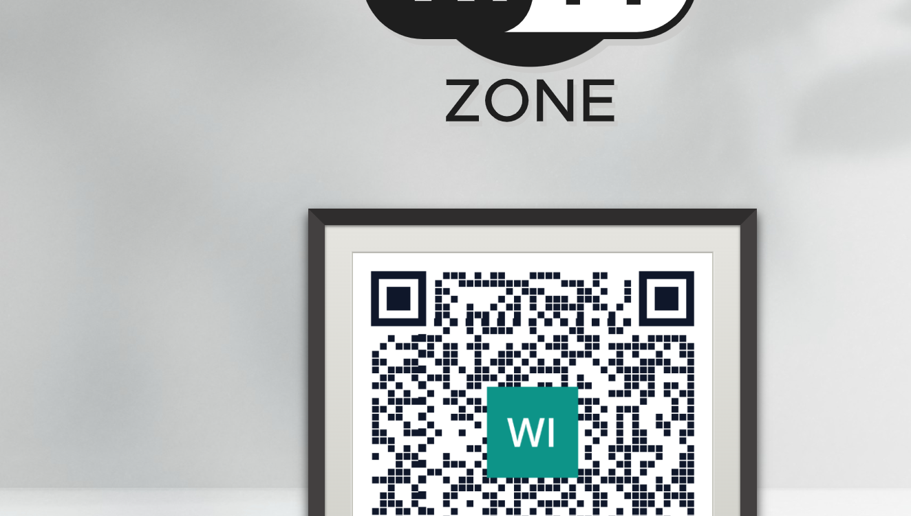
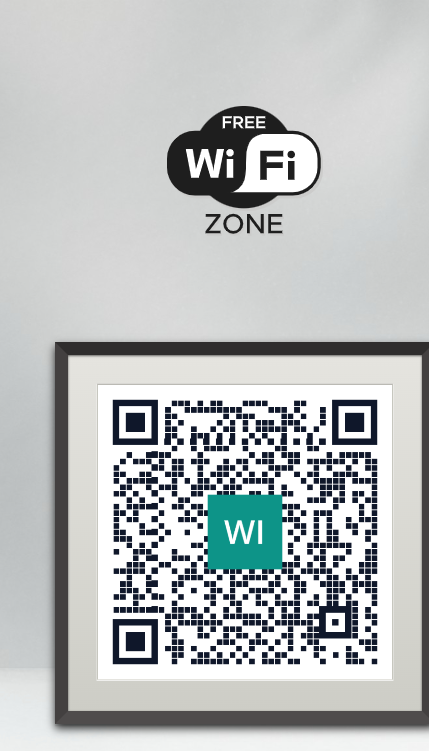
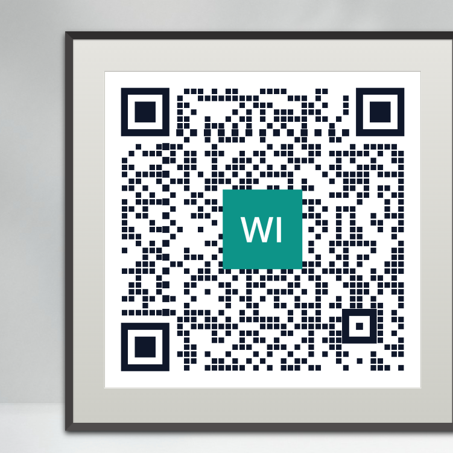

# DSPLAY - Wi-Fi QR Code Template

A [React](https://reactjs.org/) [HTML-based template](https://developers.dsplay.tv/docs/html-templates) for the [DSPLAY - Digital Signage](https://dsplay.tv/) platform — shows a full-screen QR code that connects a phone to a Wi-Fi network when scanned.

> Built with [Vite](https://vitejs.dev/), requires Node.js 22.22.2+, 24.15.0+, or 26+ (see `.nvmrc`).

## Supported screen formats

| Landscape | Portrait | Square |
|-----------|----------|--------|
|  |  |  |

| Horizontal banner | Vertical banner |
|--------------------|-------------------|
|  |  |

## Template variables

| Key                                    | Type    | Description                                                                 |
|-----------------------------------------|---------|--------------------------------------------------------------------------------|
| `qr_code_logo`                          | string  | Logo image placed at the center of the QR code.                              |
| `qr_code_logo_background_transparent`   | boolean | Whether the area behind the logo is transparent instead of solid white.       |
| `qr_code_foreground_color`              | string  | Color of the QR code's dots. Defaults to `black`.                            |
| `qr_code_background_color`              | string  | Color behind the QR code's dots. Defaults to `white`.                        |
| `qr_code_quiet_zone_color`              | string  | Color of the empty margin around the QR code. Defaults to the background color. |
| `qr_code_dot_scale`                     | float   | Size of each dot, from `0` to `1`. Defaults to `1`.                          |
| `qr_code_dot_scale_timing`              | float   | Size of the position-marker dots, from `0` to `1`. Defaults to `qr_code_dot_scale`. |

The Wi-Fi network itself (`ssid`, `auth_type`, `password`, `hidden`) comes from the media's own data, not from Template Vars — set it when scheduling this template's content in the DSPLAY CMS.

> Remember to also register the variables above as Template Vars (same name and type) when configuring this template in the DSPLAY CMS.

## Local development

```sh
npm install
npm start
```

`public/dsplay-data.js` defines `dsplay_config`/`dsplay_media`/`dsplay_template` mock globals used only when the template isn't running inside the actual DSPLAY app. Edit it to try out different Wi-Fi networks and QR code styles — the DSPLAY Player App replaces it with real content at runtime.

## Packing (release build)

```sh
npm run zip
```

This builds the template with Vite, which also generates `template-variables.json` + `template-example-data.json` (via [@dsplay/template-manifest](https://www.npmjs.com/package/@dsplay/template-manifest)'s Vite plugin) — the DSPLAY CMS reads these two files to auto-detect this template's variables and seed default preview values. It then generates `template.zip`, ready to be deployed to the [DSPLAY Web Manager](https://manager.dsplay.tv/template/create).

## Test assets

To use test assets (images, videos, etc) during development, put them in the `public/test-assets` folder and reference them in `dsplay-data.js` using their relative path. `public/test-assets` is automatically excluded from the release build.

## Maintaining dependencies

Regular npm dependencies, not vendored files:

```sh
npm outdated
npm update
```

For a version outside the declared range (typically a major bump), apply it deliberately and verify `npm start`, `npm run build`, and `npm test` still work before committing.

### Commit conventions

See [AGENTS.md](AGENTS.md).

## More

To see more about DSPLAY HTML Templates, visit: https://developers.dsplay.tv/docs/html-templates
